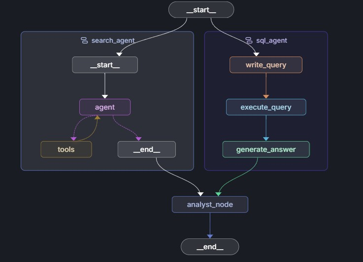
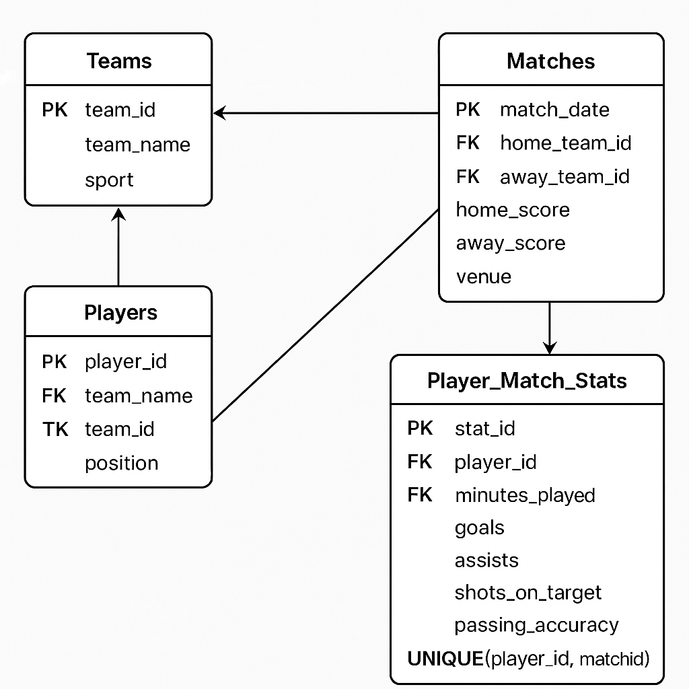

# Sorts Analyst Agent
## Overview
The Sports Analyst Agent is a cutting-edge tool that leverages web scraping, internal database querying, and natural language processing to provide in-depth sports analysis and insights. This agent utilizes a human-in-the-loop concept to engage users and generate answers based on extracted questions.

* Step 1: Web Scraping and Open Sports API
The agent begins by searching through the web and querying open sports APIs to gather relevant data on various sports, teams, players, and events. This step involves:

  Utilizing web scraping techniques to extract data from sports websites, news articles, and social media platforms.
  Querying open sports APIs, such as ESPN, Sports-Reference, or Opta Sports, to retrieve additional data.
* Step 2: Internal Database Querying
  In parallel to web scraping, the agent searches the internal database using SQL queries to retrieve relevant data. This step involves:

  Querying the internal database to retrieve data on teams, players, coaches, and past performances.
  Utilizing SQL to filter, sort, and aggregate data to provide meaningful insights.
* Step 3: Answer Generation and Stats Table
  Based on the data gathered from both web scraping and internal database querying, the agent generates answers and creates a stats table. This step involves:

  Utilizing natural language processing techniques to generate human-readable answers to user questions.
  Creating a stats table to provide a visual representation of the data, including key statistics and trends.
* Step 4: Human-in-the-Loop Questioning
  The agent engages users through a human-in-the-loop concept, using the LangGraph framework to extract questions from the user's input. This step involves:

  Utilizing LangGraph to analyze user input and extract relevant questions.
  Generating follow-up questions based on the user's response to provide additional insights and analysis.

Example Use Case
- User: "What's the current ranking of the top 5 teams in the NBA?"
-  Agent: Searches web and open sports APIs to gather data on current NBA rankings.
- Agent: Queries internal database to retrieve additional data on team performance and past rankings.
- Agent: Generates answer: "The current top 5 teams in the NBA are: 1. Lakers, 2. Bucks, 3. Raptors, 4. Celtics, 5. Nuggets."
- Agent: Creates stats table to display key statistics, such as win-loss records and points per game.
- Agent: Asks follow-up question using LangGraph: "Would you like to know the top 5 players in the NBA based on their current performance?"

Technical Requirements
Python 3.8+
  LangGraph framework
  SQL database (e.g., MySQL, PostgreSQL)
  Web scraping libraries (e.g., BeautifulSoup, Scrapy)
  Open sports API keys (e.g., ESPN, Sports-Reference)

Future Development
Integrate additional data sources, such as social media and sports analytics platforms.
Improve natural language processing capabilities to handle more complex user queries.
Enhance LangGraph framework to support more advanced human-in-the-loop interactions.

Architecture:

ER Diagram(DB):
